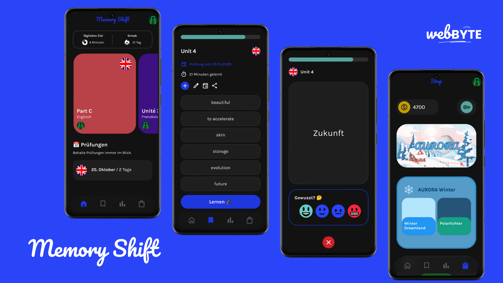

# 🗂️ 𝐌𝐞𝐦𝐨𝐫𝐲 𝐒𝐡𝐢𝐟𝐭 - 𝐋𝐞𝐚𝐫𝐧 𝐒𝐦𝐚𝐫𝐭𝐞𝐫

## 👨‍💻 Über Memory Shift

Memory Shift ist ein moderner und innovativer Vokabeltrainer für Schüler und Studenten zum effizienten und nachhaltigen Lernen von Vokabeln und Sprachen. Durch smarte Wiederholungen von Vokabeln, zwei Abfrage-Modi,
umfangreichen Statistiken und einem motivierenden Shop-System wird Lernen interaktiv und erfolgreich. Vokabellisten können mit anderen einfach geteilt werden durch eine Import/Export-Funktion. Es ist möglich, für Vokabellisten
ein Prüfungsdatum einzutragen und auf der Homepage immer den Überblick zu behalten. Memory Shift ist in Kooperation mit dem Max-Planck-Gymnasium Göttingen entstanden und wurde dort schon in mehreren Lerngruppen verwendet.

🔗 Link: [memoryshift.app](https://memoryshift.app)

### ⚡ Funktionen:
- **Vokabellisten**: Unbegrenzt Vokabellisten mit verschiedenen Sprachen hinzufügen und Vokabeln organisieren
- **Karteikarten**: Karteikartenabfrage, optimal zum nachhaltigen Lernen
- **Statistiken**: Verschiedene Statistiken und Diagramme zum Lernen
- **ShiftCoins & Theme-Shop**: Beim Lernen erhält man ShiftCoins, mit denen man im Shop App-Themes kaufen kann.
- **AccuracyTest**: Bei AccuracyTest kann man Übersetzungen eintippen zur genauen Schreibüberprüfung
- **Auswertung & Einschätzung**: Grafische Einschätzung des Verständnisses
- **Streak**: Motivierendes Streak-System
- **Prüfungsverfolgung**: Prüfungsdatum angeben & nichts verpassen
- **Intuitives UI/UX Design**: Schönes, einfaches und modernes App-Design
- **Import & Export**: Für Vokabellisten und sogar Accounts
- **Einstellungen**: App-/Lerneinstellungen konfigurieren
---

> **Memory Shift - Learn Smarter**  
> BY WEBBYTE STUDIO

  

